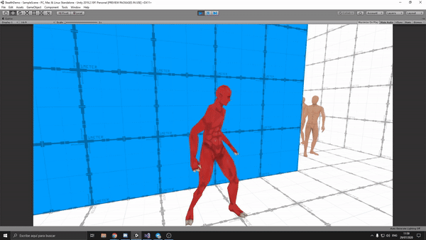

# Shader-Stealth-XRay
This is an implementation of the visual effect of many stealth and action games where the player is able to detect enemies through walls. I basically used Replacement Shaders and the Stencil Buffer to create the effect.

